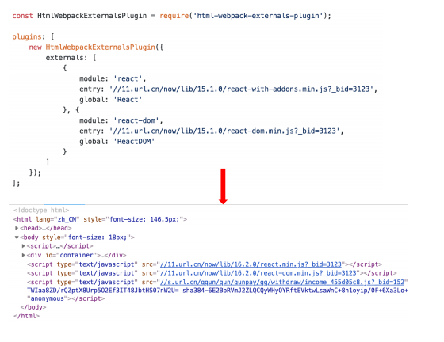
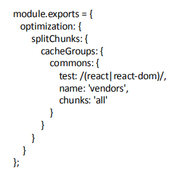
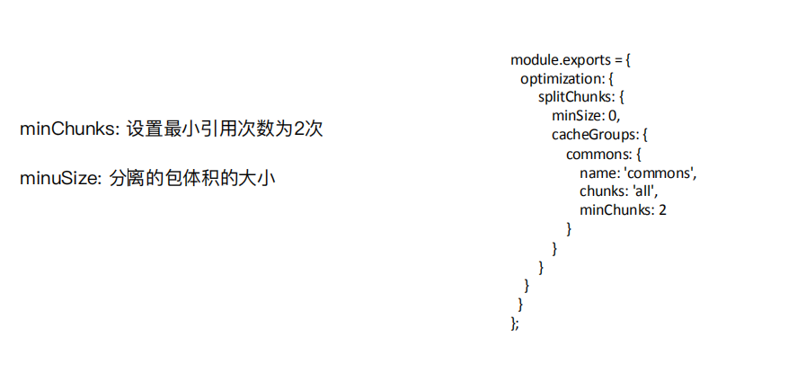
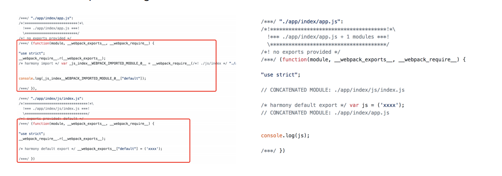
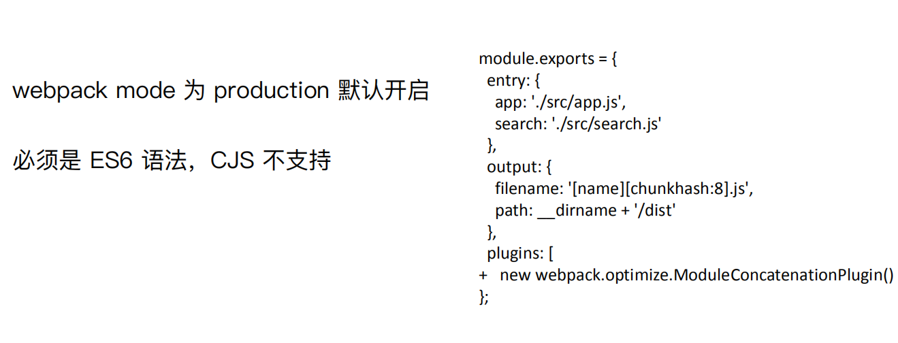
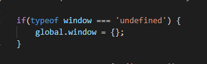

# wepbck的使用

## webpack资源的内联

1. 资源内联的好处
代码层面：

+ ⻚⾯框架的初始化脚本
+ 上报相关打点
+ css内联避免⻚⾯闪动

请求层面：减少HTTP网络请求数

+ ⼩图⽚或者字体内联 (url-loader)

## source map

1. 线上排查问题的时候可以将 sourcemap 上传到错误监控系统.

2. [source map科普文](http://www.ruanyifeng.com/blog/2013/01/javascript_source_map.html)

3. source map关键字：
    + eval: 使⽤eval包裹模块代码
    + source map: 产⽣.map⽂件
    + cheap: 不包含列信息
    + inline: 将.map作为DataURI嵌⼊，不单独⽣成.map⽂件
    + module:包含loader的sourcemap

## 提取页面公共资源

1. 基础库分离：利用CDN，不打入bundle。(使⽤ `html-webpack-externals-plugin`);


2. [SplitChunksPlugin](https://www.webpackjs.com/plugins/split-chunks-plugin/#root)分离js基础包。
`test`: 匹配出需要分离的包



3. 公共脚本分离：[SplitChunksPlugin](https://www.webpackjs.com/plugins/split-chunks-plugin/#root)。
基本配置：`chunks` 参数说明。

+ `async` 异步引⼊的库进⾏分离(默认)
+ `initial` 同步引⼊的库进⾏分离
+ `all` 所有引⼊的库进⾏分离(推荐)

4. 页面公共文件分离：[SplitChunksPlugin](https://www.webpackjs.com/plugins/split-chunks-plugin/#root)。


Note：分离出来的chunk系统要将利用HtmlWebpackPlugin的chunks字段引用到html中。

## tree-shaking（webpack借鉴与rollupjs）

定义：tree shaking 是一个术语，通常用于描述移除 JavaScript 上下文中的未引用代码(dead-code)。它依赖于 **ES2015 模块系统中的静态结构特性**，例如 import 和 export。`mode=production`默认开启`tree-shaking`。

利⽤ ES6 模块的特点:

+ 只能作为模块顶层的语句出现
+ import 的模块名只能是字符串常量
+ import binding 是 immutable的

Note：es6模块系统是编译时加载的。也就是说js在编译时已经静态引入。不同Commonjs或者seajs那样可以动态引入（运行时加载）。

## scope hoisting（同上也是借鉴rollupjs）

定义：将所有模块的代码按照引⽤顺序放在⼀个函数作⽤域⾥，然后适当的重命名⼀
些变量以防⽌变量名冲突。`mode=production`默认开启`scope-hoisting`。
作用：通过 scope hoisting 可以减少函数声明代码和内存开销。

开启的配置：


## Code Splitting与按需加载

定义：

## webpack打包库和组件

webpack除了可以打包应用，也可以用来打包js库。
应用：实现一个大整数加法库的打包。（demo在webpack-large-number）
要求：

1. 需要打包压缩版和非压缩版。见webpack-large-number里面的webpack.config.js的配置。[关于library相关的配置](https://www.webpackjs.com/guides/author-libraries/#%E5%9F%BA%E6%9C%AC%E9%85%8D%E7%BD%AE)

2. 支持AMD/CJS/ESM 模块引入，即UMD功能。
UMD原理：先判断是否支持Node.js模块格式（exports是否存在），存在则使用Node.js模块格式。
再判断是否支持AMD（define是否存在），存在则使用AMD方式加载模块。
前两个都不存在，则将模块公开到全局（window或global）。

```js
(function webpackUniversalModuleDefinition(root, factory) {
 if(typeof exports === 'object' && typeof module === 'object')
  module.exports = factory();
 else if(typeof define === 'function' && define.amd)
  define([], factory);
 else if(typeof exports === 'object')
  exports["largeNumber"] = factory();
 else
  root["largeNumber"] = factory();
})(window, function() {
return /******/ (function(modules) { // webpackBootstrap
        // webapck 模块相关的代码
/******/  return __webpack_require__(__webpack_require__.s = 0);
/******/ })
/************************************************************************/
/******/ ([
/* 0 */
/***/ (function(module, __webpack_exports__, __webpack_require__) {

"use strict";
__webpack_require__.r(__webpack_exports__);
/* harmony export (binding) fucnt*/ __webpack_require__.d(__webpack_exports__, "default", function() { return add; });
function add(a,b){}
/***/ })
/******/ ])["default"];
});
```

3. 用`npm publish`发布到npm上面

## webpack打包SSR(demo为webpack-ssr-demo)

1. 创建后端对应的Router。返回静态资源。（包括打包后html,css，asset等）。

2. 前端组件要用Commonjs的加载。

3. 后端的window不存在，需要加上一个hack。

。

4. webpack打包的`mode`要对应是`none`，`output.libraryTarget`要对应的是`umd`, 这样打包后的js才能以`commonjs`方式加载。

5. 前端对应的html利用占位符替换react渲染出来的html和后端的data。

## 显示日志

1. 配置项`status`[多种属性值](https://webpack.js.org/configuration/stats/)。

2. 可以利用`friendly-errors-webpack-plugin`插件优化构建日志。

3. 在CI/CD 的pipline 或者发布系统需要知道当前构建状态，每次构建完成后输⼊入echo $? 获取错误码

## 构建异常和中断处理

### webpack4 之前的版本构建失败不会抛出错误码(error code)，Node.js 中的process.exit 规范

+ 0   表示成功完成，回调函数中，err 为null

+ 非0 表示执⾏行行失败，回调函数中，err 不不为null，err.code 就是传给exit 的数字

### 主动捕获并处理理构建错误

compiler (*webpack中重要的一个对象*) 在每次构建结束后会触发`done`这个hook。

```js
plugins:[
  function() {
              this.hooks.done.tap('done', (stats) => {
                  if (stats.compilation.errors && stats.compilation.errors.length && process.argv.indexOf('--watch') == -1)
                  {
                      console.log('build error');
                      process.exit(1);
                  }
              })
  }]
```

## webpack的优化策略

1. 利用stats查看本次的打包的初级情况。

2. 速度分析：[使用speed-measure-webpack-plugin](https://github.com/stephencookdev/speed-measure-webpack-plugin)

3. 体积分析：[使用webpack-bundle-analyzer](https://github.com/webpack-contrib/webpack-bundle-analyzer)

4. 使用高版本的nodejs和webpack

5. 多进程/多实例构建：资源并行解析可选方案。[HappyPack](https://github.com/amireh/happypack)和[thread-loader](https://github.com/webpack-contrib/thread-loader)。*Demo为webpack-multi-threaded-packaging*。

6. 多线程并行压缩:
    + [parallel-uglify-plugin](https://github.com/gdborton/webpack-parallel-uglify-plugin) 插件
    + [uglifyjs-webpack-plugin](https://github.com/webpack-contrib/uglifyjs-webpack-plugin) 开启parallel 参数
    + [terser-webpack-plugin](https://github.com/webpack-contrib/terser-webpack-plugin) 开启parallel 参数 *推荐*

7. 分包
    + 使用html-webpack-externalsplugin。将react、react-dom 基础包通过cdn 引入，不打入bundle 中
    + 使用DLLPlugin 进行分包，DllReferencePlugin对manifest.json 引用。将react、react-dom、redux、react-redux基础包和业务基础包打包成一个文件。
相关配置：生成libary。配置webpack.dll.js

```js
const path  = require('path');
const webpack = require('webpack');

module.exports = {
    entry: {
            library: ['react','react-dom']
    },
    output: {
        filename: '[name]_[chunkhash].dll.js',
        path: path.join(__dirname, 'build/library'),
        library: '[name]'
    },
    plugins: [
        new webpack.DllPlugin({
            name: '[name]_[hash]',
            path: path.join(__dirname, 'build/library/[name].json')
        })
    ]
}
```

DllReferencePlugin 引用manifest.json

```js
module.exports = {
    plugins:[
        new webpack.DllReferencePlugin({
            manifest: require('./build/library/library.json')
        })
    ]
}
```

8. 缓存: 提升二次构建速度。
    + babel-loader 开启缓存。在babel-loader后面加上`cacheDirectory=true`。
    + terser-webpack-plugin 开启缓存。 在option里面加上`cache=true`。
    + 使用cache-loader或者hard-source-webpack-plugin。

9. 缩小构建目标，即尽可能减少构建模块。
    + babel-loader 不解析node_modules。loader中加入`exclude=node_modules`
    + 减少文件搜索范围

```js
module.exports = {
    resolve:{
        alias: {
            'react': path.resolve(__dirname, './node_modules/react/umd/react.production.min.js'),
            'react-dom': path.resolve(__dirname, './node_modules/react-dom/umd/react-dom.production.min.js'),
        },
        extensions: ['.js'],
        mainFields: ['main']
    }
}
```

9. tree shaking. 上面已有提到。这里主要讲解擦除无用的CSS。
    + PurifyCSS: 遍历代码，识别已经用到的CSS class
    + uncss: HTML 需要通过jsdom 加载，所有的样式通过PostCSS解析，通过document.querySelector 来识别在html 文件里面不存在的选择器
Notes: purgecss-webpack-plugin和mini-css-extract-plugin 配合使用。[webpack配置见这里](https://purgecss.com/plugins/webpack.html)