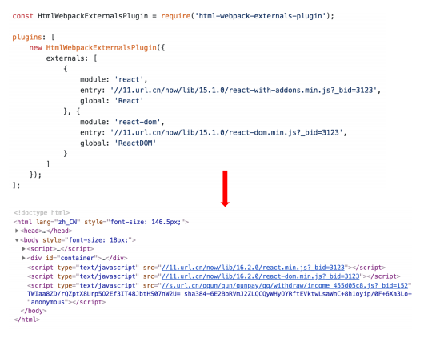
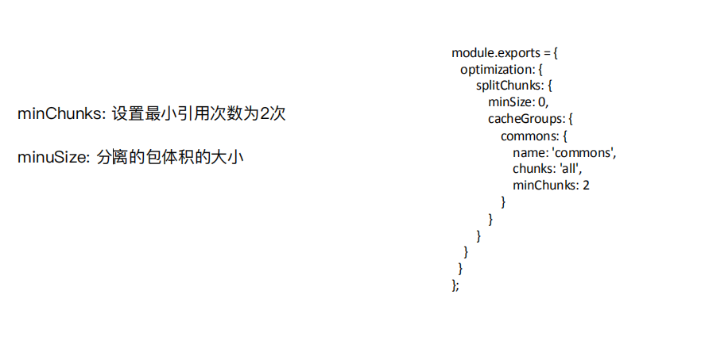
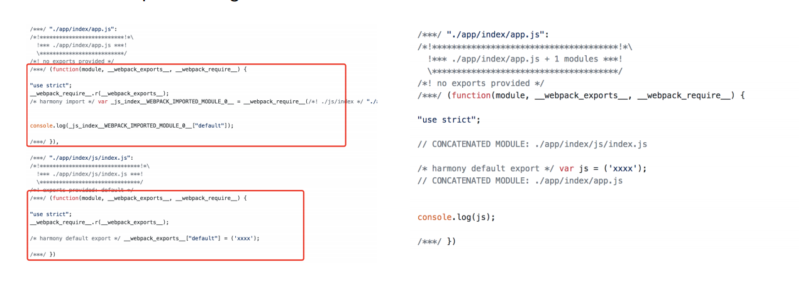
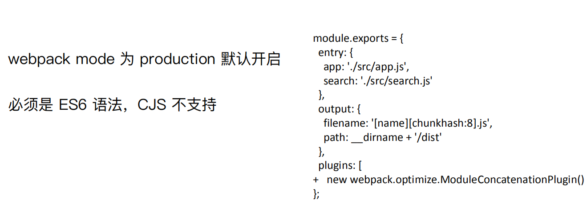

# wepbck的使用

## webpack资源的内联

1. 资源内联的好处
代码层面：

+ ⻚⾯框架的初始化脚本
+ 上报相关打点
+ css内联避免⻚⾯闪动

请求层面：减少HTTP网络请求数

+ ⼩图⽚或者字体内联 (url-loader)

## source map

1. 线上排查问题的时候可以将 sourcemap 上传到错误监控系统.

2. [source map科普文](http://www.ruanyifeng.com/blog/2013/01/javascript_source_map.html)

3. source map关键字：
    + eval: 使⽤eval包裹模块代码
    + source map: 产⽣.map⽂件
    + cheap: 不包含列信息
    + inline: 将.map作为DataURI嵌⼊，不单独⽣成.map⽂件
    + module:包含loader的sourcemap

## 提取页面公共资源

1. 基础库分离：利用CDN，不打入bundle。(使⽤ `html-webpack-externals-plugin`);

2. [SplitChunksPlugin](https://www.webpackjs.com/plugins/split-chunks-plugin/#root)分离js基础包。
`test`: 匹配出需要分离的包

3. 公共脚本分离：[SplitChunksPlugin](https://www.webpackjs.com/plugins/split-chunks-plugin/#root)。
基本配置：`chunks` 参数说明。

+ `async` 异步引⼊的库进⾏分离(默认)
+ `initial` 同步引⼊的库进⾏分离
+ `all` 所有引⼊的库进⾏分离(推荐)

4. 页面公共文件分离：[SplitChunksPlugin](https://www.webpackjs.com/plugins/split-chunks-plugin/#root)。

Note：分离出来的chunk系统要将利用HtmlWebpackPlugin的chunks字段引用到html中。

## tree-shaking（webpack借鉴与rollupjs）

定义：tree shaking 是一个术语，通常用于描述移除 JavaScript 上下文中的未引用代码(dead-code)。它依赖于 **ES2015 模块系统中的静态结构特性**，例如 import 和 export。`mode=production`默认开启`tree-shaking`。

利⽤ ES6 模块的特点:

+ 只能作为模块顶层的语句出现
+ import 的模块名只能是字符串常量
+ import binding 是 immutable的

Note：es6模块系统是编译时加载的。也就是说js在编译时已经静态引入。不同Commonjs或者seajs那样可以动态引入（运行时加载）。

## scope hoisting（同上也是借鉴rollupjs）

定义：将所有模块的代码按照引⽤顺序放在⼀个函数作⽤域⾥，然后适当的重命名⼀
些变量以防⽌变量名冲突。`mode=production`默认开启`scope-hoisting`。
作用：通过 scope hoisting 可以减少函数声明代码和内存开销。

开启的配置：

## Code Splitting与按需加载

定义：

## webpack打包库和组件

webpack除了可以打包应用，也可以用来打包js库。
应用：实现一个大整数加法库的打包。（demo在webpack-large-number）
要求：

1. 需要打包压缩版和非压缩版。

2. 支持AMD/CJS/ESM 模块引入。
